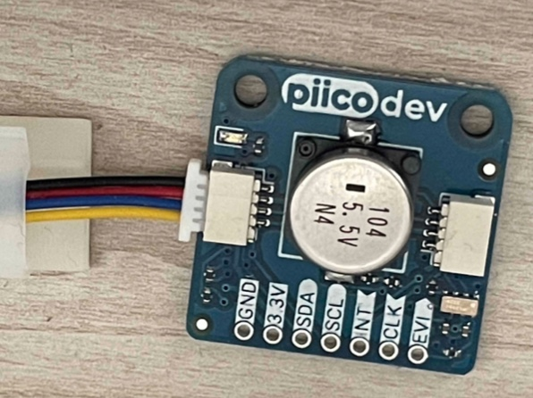
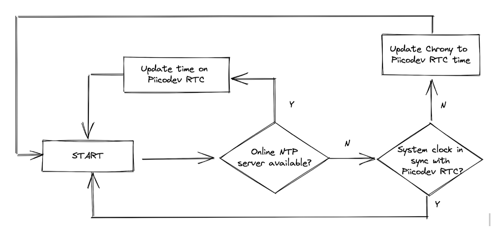

# Piicodev-Chrony
[Chrony NTP sever](https://chrony.tuxfamily.org/) syncing with the [Piicodev Real Time Clock](https://core-electronics.com.au/piicodev-real-time-clock-rv3028.html), for accurate timekeeping on a Raspberry Pi.

<p align="center" width="100%">
	 
</p>

## Why?

Raspberry Pis make great general-purpose computers for hobbyists, but they lack a real time clock for accurate timekeeping. As such, they are reliant on external NTP servers to keep their time.

In the unlikely event that power to the Raspberry Pi is cut, and an internet connection is not available when power is restored, the time on the Raspberry Pi will revert to the last known time when it was running.

Using the Piicodev RTC, we can keep the current time, and use a Raspberry Pi as an NTP server for other devices.

## You will need

* A Raspberry Pi (note this won't work on Raspberry Pi Pico)
* [Piicodev RTC module](https://core-electronics.com.au/piicodev-real-time-clock-rv3028.html)
* [Piicodev Raspberry Pi adapter](https://core-electronics.com.au/piicodev-adapter-for-raspberry-pi.html)
* Piicodev, Qwiic or Stemma cable
* A working install of Docker on your Raspberry Pi

### How it works

The logic of the script was simple: If an external NTP server is available, and Chrony is in sync, then Chrony's time is deemed correct and the script will update the Piicodev RTC with the current time.

If internet access is unavailable, and the system time is earlier than then the time reported on the RTC, then the system time is out of sync. The script will then update Chrony with the time on the RTC, which should in then turn update the system time. Any other devices configured to use the Chrony server as a fallback will also stay in sync.

<p align="center" width="100%">
	 
</p>

There's a margin of error of 1 second, and the script runs every 30 seconds.

## Build and run

The NTP server and script runs in a docker-container

Clone the repository, and build with
```sh
git clone http://github.com/lo-decibel/Piicodev-Chrony
cd Piicodev-Chrony
docker build -t piicodev-chrony .
```

You will need to change the `TZ` variable in `docker-compose.yml` to your local timezone. Optionally, you can specify a different external NTP server.

Then run with,

```sh
docker compose up -d
```

## Point your devices to Chrony NTP

The final step is to point your devices to Chrony. On a Raspberry Pi, run

```sh
sudo nano /etc/systemd/timesyncd.conf
```

Uncomment the line beginning with `#FallbackNTP=`, and append the hostname or IP address of your Chrony instance. It should now look something similar to this:

```
FallbackNTP=0.debian.pool.ntp.org 1.debian.pool.ntp.org 2.debian.pool.ntp.org 3.debian.pool.ntp.org 4.raspberrypi.local
```

Restart your Pi.

```sh
sudo reboot
```

Pull requests welcome.

LICENSE: CC BY-NC-SA